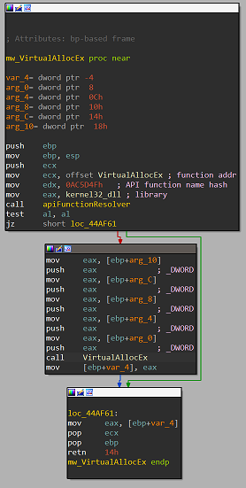
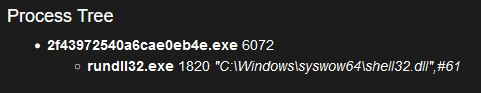
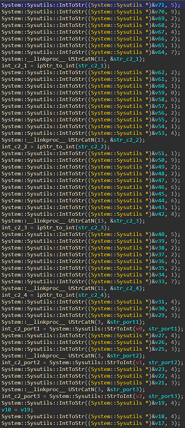

# Danabot update : version 2278

One year after the blog post made by @proofpoint about #Danabot update, Danabot has been recently subject to a new update.
The downloader and the main module embeds the same changes, new api hashing, the configuration is stored differently, anti reverse engineering tricks... These notes will be mainly focused on the downloader.

## Downloader 
### Anti-analysis 
Like in the previous version, many strings are constructed char by char, this new version also embeds API hashing to resolve windows API functions when needed. 



*Resolve VirtualAllocEx address then call this function*

This version also embeds shellcode tricks to modify the instruction pointer. 
```
.text:0057E551 E8 00 00 00 00                                call    $+5
.text:0057E556 58                                            pop     eax
.text:0057E557 83 C0 09                                      add     eax, 9
.text:0057E55A 50                                            push    eax
.text:0057E55B C2 00 00                                      retn    0
```
### Process injection
The downloader acts now differently, it creates a process then performs code injection. The injected code is in charge of downloading the main module.





### Communication with the c2
The communication between the downloader and the C&Cs was previously established using the ws2_32 library (connect, send, recv...). Now, it uses the wininet library to send a GET http request to the C&C with a base64 encoded path in the url.

Example of a base64 path url : `/IDUzQTYyRDM2RTUwRkRGNzNBQjU5MUI2QjJCMjdCQ0FCy6UFAA==`
```
>>> base64.b64decode("IDUzQTYyRDM2RTUwRkRGNzNBQjU5MUI2QjJCMjdCQ0FCy6UFAA==")
' 53A62D36E50FDF73AB591B6B2B27BCAB\xcb\xa5\x05\x00'
```


Once decoded we can notice some values :
- "\x20" : Length of the hash
- "53A62D36E50FDF73AB591B6B2B27BCAB" : The embedded hash
- "\xcb\x5a" : Probably the command sent to the C2 **[I have to double check this]**
- "\x05\x00" : Affiliate ID


### Main module decryption
The embedded hash previously stored directly in the binary, is now constructed char by char. It is used to decrypt the main module. The hash is concatenated with an integer value previously converted to string (each hash has a different integer value), then passed to a md5 hexdigest function. 


The AES256 key used to decrypt the main module is obtained through `CryptDeriveKey` based on the MD5 of the uppercase hex digest of the embedded hash concatenated with an integer value. Once decrypted the main module is compressed using ZIP.

```
.text:005D8561 0F 31                                         rdtsc
.text:005D8563 8D 95 58 FC FF FF                             lea     edx, [ebp-3A8h]
.text:005D8569 B8 19 00 00 00                                mov     eax, 19h        ; Convert 0x19 to string
.text:005D856E E8 E5 7F E4 FF                                call    @System@Sysutils@IntToStr$qqri ; System::Sysutils::IntToStr(int)
.text:005D8573 8B 8D 58 FC FF FF                             mov     ecx, [ebp-3A8h]
.text:005D8579 8B 15 10 ED 5F 00                             mov     edx, pptrEmbeddedHash
.text:005D857F 8B 12                                         mov     edx, [edx]
.text:005D8581 8D 85 5C FC FF FF                             lea     eax, [ebp-3A4h]
.text:005D8587 E8 18 26 E3 FF                                call    @System@@UStrCat3$qqrr20System@UnicodeStringx20System@UnicodeStringt2 ; System::__linkproc__ UStrCat3
.text:005D858C 8B 95 5C FC FF FF                             mov     edx, [ebp-3A4h] ; EmbeddedHash concatenated with "25"
.text:005D8592 8D 85 60 FC FF FF                             lea     eax, [ebp-3A0h]
.text:005D8598 B9 00 00 00 00                                mov     ecx, 0
.text:005D859D E8 DE 20 E3 FF                                call    LStrFromPWCharLen
.text:005D85A2 8B 85 60 FC FF FF                             mov     eax, [ebp-3A0h] ; EmbeddedHash concatenated with "25"
.text:005D85A8 8D 95 64 FC FF FF                             lea     edx, [ebp-39Ch]
.text:005D85AE E8 1D 3F F7 FF                                call    MD5_hexdigest   ; Returns the MD5 uppercase hex digest
.text:005D85B3 8B 95 64 FC FF FF                             mov     edx, [ebp-39Ch]
.text:005D85B9 8D 85 68 FC FF FF                             lea     eax, [ebp-398h]
.text:005D85BF B9 00 00 00 00                                mov     ecx, 0
.text:005D85C4 E8 B7 20 E3 FF                                call    LStrFromPWCharLen
.text:005D85C9 8B 95 68 FC FF FF                             mov     edx, [ebp-398h] ; MD5 uppercase hex digest
.text:005D85CF A1 D8 EB 5F 00                                mov     eax, memStream_mainModule
.text:005D85D4 E8 6B 9B F6 FF                                call    decryptMainModule ; mw_DecryptMainModule
.text:005D85D9 84 C0                                         test    al, al
```

## Main module configuration
The C&Cs ip addresses and ports are now constructed char by char, then concatenated and finally converted to an integer.





## Sample analyzed
https://bazaar.abuse.ch/sample/b20753700e6839173e63c607bd2e7da1da85b3d46f7c67b8e4b819814ff898ba/

Danabot version : 2278

Affiliate ID : 5

Tor url : ockiwumgv77jgrppj4na362q4z6flsm3uno5td423jj4lj2f2meqt6ad.onion

Embedded hash : 53A62D36E50FDF73AB591B6B2B27BCAB

Magic number concatenated with the hash used to get the main module decrypt key : 25

- C2_1 : 5.9.224.217:443
- C2_2 : 23.106.122.14:443
- C2_3 : 192.236.161.4:443